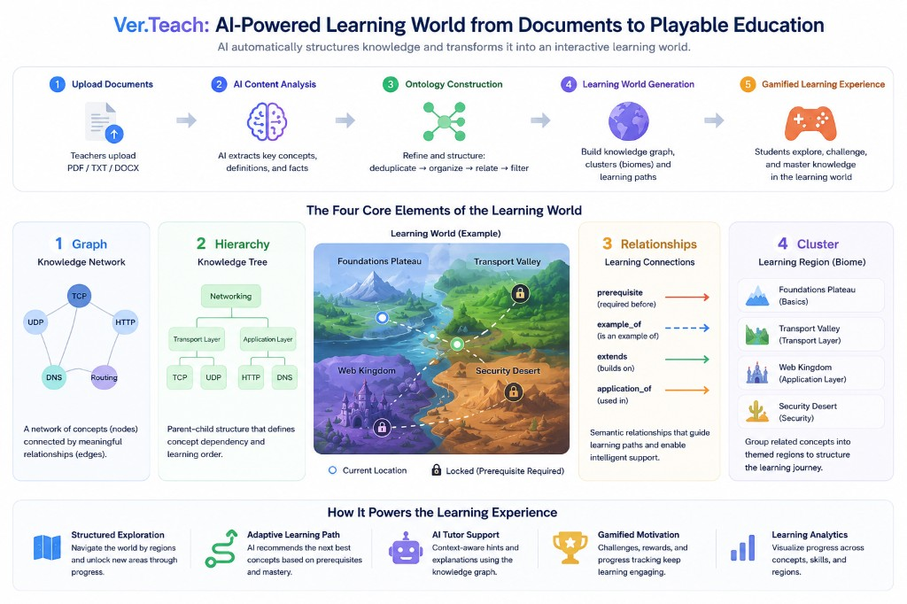
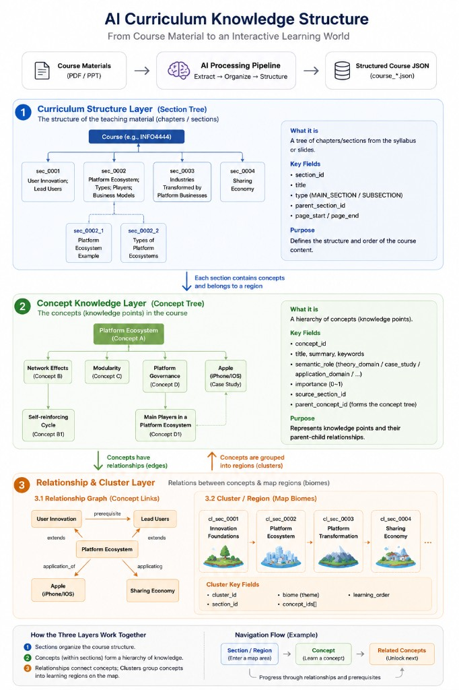

# AI Driven eLearning System

**Current release: Ver.Teach** — teacher-centric course generation, ontology refinement, and layered course graph (curriculum + concept tree + learning regions). Student map and gameplay consume this graph as the progression backbone.

### Ver.Teach at a glance

From documents to a playable learning world: upload → AI extraction → ontology refinement → learning-world graph (hierarchy, four relationship types, regional clusters / biomes) → gamified exploration.



---

AI Driven eLearning System is a full-stack learning platform that combines:
- AI-assisted course understanding from uploaded materials (PDF/TXT/MD)
- Structured knowledge modeling (concepts, facts, examples, topics, levels, relationships)
- Gamified student learning (map exploration + AI tutor dialogue + battle-style assessment)
- Teacher-side content generation, progress tracking, and report workflows

The current implementation uses a React + TypeScript frontend and a Flask backend, with local LLM inference via Ollama (Qwen2.5 by default).

---

## Key Features

### Teacher Portal
- Upload learning materials and generate courses asynchronously.
- **Runtime LLM routing**: switch between **Ollama (local Qwen)** and **Google Gemini** (and **Auto**) from the header without restarting the backend; optional **Env default** clears the override and follows `LLM_PROVIDER` again (`GET`/`POST /api/teacher/llm-settings`).
- Real-time generation progress with percentage and stage updates.
- Optional "thinking trace" display while processing.
- Structured preview mode for generated knowledge (`concept_index`, topics, levels, relationships).
- Legacy materials preview mode for backward compatibility.
- Apply generated courses to the game map.

### Student Experience
- Explore course chapters through a map-based progression system.
- Chat with an AI tutor in each area.
- Learn individual knowledge points by index.
- Track learning progress and unlock battle challenges.
- Complete battle/test flows and unlock subsequent areas.
- Generate area/final reports through backend report APIs.

### Knowledge Modeling Pipeline (Backend) — Ver.Teach

The layered course artifact ties **curriculum (section tree)** → **concept tree** → **relationship graph** → **map clusters / biomes**. The diagram below matches the JSON shape under `knowledge_structure` / `course_path` (sections, concepts with `semantic_role` and `parent_concept_id`, typed edges, clusters).



Course generation follows a staged pipeline:
1. **Chunking**: split source text into small chunks suitable for local 7B models (section-aware headers).
2. **Atomic extraction**: per chunk, strategy-aware extraction (theory, application, case, recap, reference).
3. **Deterministic merge**: merge chunk outputs with provenance (`source_section_id`).
4. **Ontology refinement (deterministic)**:
   - Quality filter (syllabus noise, placeholders, low pedagogical signal).
   - Dedup / canonical titles (plural, acronym, overlap, optional embeddings).
   - **Learning tree**: `parent_concept_id` from topic hubs + lexical/definition cues (acyclic).
   - **Learning graph edges only**: `prerequisite`, `example_of`, `extends`, `application_of` (narrow vocabulary; weak types dropped).
   - Section-aligned clusters (“learning regions”) for map generation.
5. **Classification**: LLM assigns topic and level (feeds hierarchy and clustering).
6. **Relationship inference (LLM, optional)**: constrained to the same four edge types; merged then re-normalized.
7. **Structured output**: layered v2 `course_path` with `curriculum`, `graph` (concepts, relationships, clusters), plus runtime `materials` / `knowledge_structure` for the app.

---

## Tech Stack

- **Frontend**: React 19, TypeScript, Vite, Emotion, Framer Motion, Axios
- **Backend**: Flask 3.1, Flask-CORS, PyPDF2, Requests, ReportLab
- **LLM**: Ollama (local, default `qwen2.5`), optional **Google Gemini** via REST (`GOOGLE_AI_API_KEY` / `GEMINI_API_KEY`, `GEMINI_MODEL`, `LLM_PROVIDER`)
- **Infra**: Docker, Docker Compose, Nginx, Jenkins pipeline files
- **Persistence (current)**: JSON files for courses, uploads, reports, and game state

---

## Project Structure

```text
AI_driven_elearning_sys/
├── docs/
│   ├── ver-teach-overview.png              # Ver.Teach workflow / map overview
│   └── ai-curriculum-knowledge-structure.png  # Layered curriculum → concept → graph → clusters
├── backend/
│   ├── app.py
│   ├── requirements.txt
│   ├── courses/
│   ├── uploads/
│   └── reports/
├── frontend/
│   ├── src/
│   ├── package.json
│   ├── nginx.conf
│   └── Dockerfile
├── docker-compose.yml
└── README.md
```

---

## Quick Start (Local Development)

## 1) Prerequisites
- Python 3.9+ (3.10+ recommended)
- Node.js 18+
- npm 9+
- Ollama installed and running locally

## 2) Start Ollama and pull model
```bash
ollama serve
ollama pull qwen2.5
```

## 3) Start backend
```bash
cd backend
pip install -r requirements.txt
python app.py
```

Backend default URL: `http://127.0.0.1:8001/api`

## 4) Start frontend
```bash
cd frontend
npm install
npm run dev
```

Frontend dev URL is printed by Vite (typically `http://127.0.0.1:5173`).

---

## Environment Configuration

Frontend reads:
- `VITE_API_BASE_URL` (default fallback: `http://127.0.0.1:8001/api`)
- `VITE_OLLAMA_URL` (default fallback: `http://127.0.0.1:11434`, or `/ollama` in production)

Example:

```bash
VITE_API_BASE_URL=http://127.0.0.1:8001/api
VITE_OLLAMA_URL=http://127.0.0.1:11434
```

### Backend LLM (course generation and chat proxies)

| Variable | Meaning |
|----------|---------|
| `LLM_PROVIDER` | `ollama` (default), `gemini`, or `auto` (Gemini when a key is present, else Ollama). |
| `GOOGLE_AI_API_KEY` or `GEMINI_API_KEY` | Enables Gemini for generation when provider allows it. |
| `GEMINI_MODEL` | REST model id (legacy ids are normalized to a supported default). |

The teacher UI can override `LLM_PROVIDER` for the running process via `/api/teacher/llm-settings` without editing the shell environment.

Note: Cloud model keys are also referenced in `frontend/src/config/apiKeys.ts` for client-side chat UIs. For production, migrate keys to environment variables or a secrets manager.

---

## Run with Docker Compose

```bash
docker compose up --build
```

Default exposed ports:
- Frontend: `80`
- Backend: `8001`
- Ollama: `11434`

Compose uses named volumes for backend uploads/courses/reports and Ollama model data persistence.

---

## Main API Endpoints

The backend exposes REST APIs under `/api`:

- `GET /api/game-state`
- `POST /api/complete-area/<area_id>`
- `POST /api/update-learning-progress/<area_id>`
- `POST /api/upload-pdf`
- `GET|POST /api/teacher/llm-settings` — runtime course-generation provider (Ollama / Gemini / Auto / clear to env)
- `POST /api/google-chat` — chat proxy (Gemini or Ollama per provider rules)
- `POST /api/generate-course`
- `POST /api/generate-course-async`
- `GET /api/generate-course-progress/<job_id>`
- `GET /api/courses`
- `DELETE /api/courses/<course_id>`
- `POST /api/apply-course-to-game`
- `GET /api/course-library/<area_id>`
- `POST /api/save-battle-record`
- `GET /api/get-battle-records/<student_id>`
- `POST /api/reports/generate-area`
- `POST /api/reports/generate-final`
- `POST /api/reports/generate-subject-final`
- `GET /api/reports/<student_id>`

---

## Data Output Shape (Course Generation)

Generated course data includes (high-level):
- `subject`
- `materials` (array of structured objects; no longer plain strings)
- `difficulty`
- `category`
- `topics`
- `knowledge_structure`:
  - `pipeline`
  - `concept_index`
  - `topics`
- `thinking_trace` (optional process trace)

This structure is designed for richer downstream rendering and logic (student tutor, quizzes, pathing, analytics).

---

## Development Notes

- JSON file storage is currently used for fast iteration and debugging.
- Course generation has both synchronous and asynchronous endpoints; frontend prefers async for progress visualization.
- Student and teacher UIs include backward-compatibility handling for older course formats.
- If API behavior appears outdated after code changes, restart backend to ensure newest routes are loaded.
- Switching **Gemini vs Ollama** for course generation does **not** require a restart when done through the Teacher Portal or `POST /api/teacher/llm-settings`.

---

## Changelog (recent)

### 2026-05-14
- **Docs**: Added `docs/ai-curriculum-knowledge-structure.png` and embedded it in the Ver.Teach knowledge pipeline section (section tree → concept tree → relationships → map clusters).
- **Teacher Portal**: English UI strip for **Course generation** — active provider, buttons **Ollama (qwen)**, **Gemini**, **Auto**, **Env default**; calls `GET`/`POST /api/teacher/llm-settings`.
- **Backend**: Thread-safe in-memory override for `_llm_provider_resolved()` so course generation can use Gemini or Ollama without process restart.
- **Backend (ongoing Ver.Teach)**: Layered course JSON, ontology refinement, prerequisite/graph semantics, Gemini REST integration with model id normalization, async generation and progress APIs (see pipeline list above).

---

## Troubleshooting

### "Processing failed" / endpoint 404
- Ensure backend process is the latest code version.
- Restart backend after pulling/changing API routes.

### Student dialogue cannot answer normally
- Ensure Ollama is running and model is available.
- Verify `VITE_OLLAMA_URL` / backend API base URL.
- Confirm course `materials` are in expected structured format and frontend normalization is applied.

### No course history visible
- Check backend `courses/` path and permissions.
- Confirm course files exist and are readable by backend process.

---

## Roadmap (Suggested)

- Replace JSON persistence with a database (PostgreSQL or MongoDB).
- Add authentication and role management.
- Move API keys to secure backend-managed secrets.
- Add integration tests for course generation and student dialogue flows.
- Improve observability (structured logs, metrics, job tracing).

---

## License

No license file is currently defined in this repository. Add a license before public distribution.
